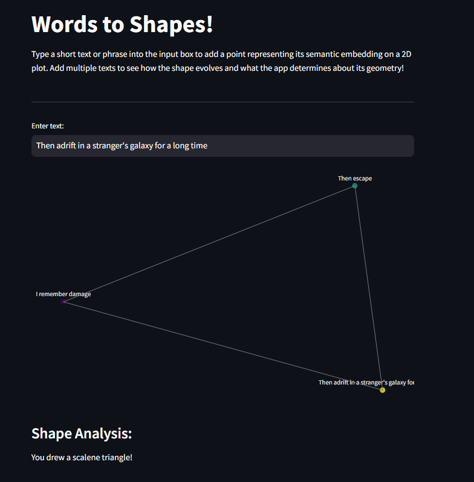

# Words to Shapes!

## 2D Text Embedding Visualization with Streamlit

This application visualizes text embeddings in 2D space, reducing high-dimensional vector representations (generated using a pre-trained model) down to two dimensions using Principal Component Analysis (PCA). Users can input multiple text strings, which are embedded, reduced, and plotted interactively on a 2D graph, with lines connecting consecutive inputs to form shapes.

### Features
- **Text Embedding**: Converts input text into high-dimensional embeddings using a Sentence Transformer model.
- **Dimensionality Reduction**: Embeddings are reduced from 768 dimensions to 2 using Principal Component Analysis (PCA).
- **Dynamic Plotting**: Multiple text inputs are visualized as 2D points on an interactive Plotly graph. Each point is connected to the previous one, with the last point linked back to the first, forming a closed shape.
- **Shape Analysis**: The app analyzes the shape formed by the points and provides feedback on the identified shape, such as "You drew an equilateral triangle!" or "You drew a square!"

### Prerequisites
Ensure the following dependencies are installed:

- `streamlit`
- `sentence-transformers`
- `scikit-learn`
- `plotly`

### How It Works
1. Enter Text: Input any text into the provided input box.
2. Generate Embeddings: The app generates vector embeddings (currently 768 dimensions).
3. Dimensionality Reduction: Embeddings are reduced to 2D using PCA.
4. Visualization: Each input is visualized as a point on a 2D scatter plot, with lines connecting consecutive points and forming a closed loop.
5. Shape Analysis: The app analyzes the resulting shape and displays its analysis.
